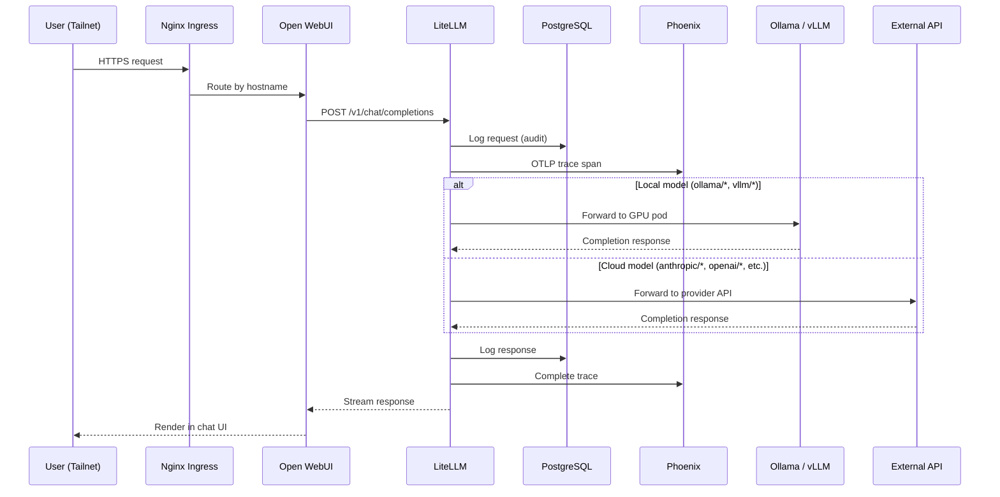

# Architecture

```mermaid
graph TB
    subgraph internet["Public Internet"]
        user["You (laptop/phone)"]
    end

    subgraph tailnet["Tailscale Mesh VPN"]
        direction TB

        subgraph droplet["Digital Ocean GPU Droplet — NixOS"]
            direction TB

            subgraph nixos["NixOS Layer"]
                nvidia["NVIDIA Drivers + Container Toolkit"]
                k3s["k3s (Kubernetes)"]
                ts["Tailscale Daemon"]
                fw["Firewall: SSH only public"]
            end

            subgraph k8s["k3s Cluster — ai-lab namespace"]
                direction TB

                subgraph ingress["Nginx Ingress Controller"]
                    ing_litellm["litellm.gpu-lab.*.ts.net"]
                    ing_webui["openwebui.gpu-lab.*.ts.net"]
                    ing_phoenix["phoenix.gpu-lab.*.ts.net"]
                    ing_grafana["grafana.gpu-lab.*.ts.net"]
                end

                subgraph gateway["LLM Gateway"]
                    litellm["LiteLLM :4000\n(proxy/router)"]
                    webui["Open WebUI :8080\n(chat frontend)"]
                end

                subgraph gpu_inference["GPU Inference (shared GPU)"]
                    ollama["Ollama :11434\n(llama3.1, deepseek-r1)"]
                    vllm["vLLM :8000\n(DeepSeek-R1)"]
                end

                subgraph data["Data Stores"]
                    pg["PostgreSQL :5432\n(LiteLLM state)"]
                    neo4j["Neo4j :7474/:7687\n(graph/documents)"]
                end

                subgraph observability["Observability"]
                    phoenix["Phoenix :6006\n(OTLP traces)"]
                    prom["Prometheus :9090\n(metrics)"]
                    grafana["Grafana :3000\n(dashboards)"]
                end

                subgraph search["Search"]
                    searxng["SearXNG :8080\n(web search for RAG)"]
                end
            end
        end
    end

    subgraph providers["External LLM Providers"]
        anthropic["Anthropic API"]
        openai["OpenAI API"]
        bedrock["AWS Bedrock"]
        google["Google Gemini"]
        azure["Azure OpenAI"]
        xai["xAI (Grok)"]
        together["Together AI"]
    end

    %% User access via Tailscale
    user -->|"Tailscale VPN"| ts
    ts --> ing_webui
    ts --> ing_litellm
    ts --> ing_phoenix
    ts --> ing_grafana

    %% Ingress routing
    ing_litellm --> litellm
    ing_webui --> webui
    ing_phoenix --> phoenix
    ing_grafana --> grafana

    %% Service connections
    webui -->|"OpenAI-compatible API"| litellm
    webui -->|"RAG search"| searxng
    litellm -->|"state/audit logs"| pg
    litellm -->|"OTLP gRPC :4317"| phoenix
    litellm -->|"metrics /metrics"| prom
    prom --> grafana

    %% LiteLLM to models
    litellm -->|"ollama/"| ollama
    litellm -->|"hosted_vllm/"| vllm
    litellm -->|"anthropic/"| anthropic
    litellm -->|"openai/"| openai
    litellm -->|"bedrock/"| bedrock
    litellm -->|"gemini/"| google
    litellm -->|"azure/"| azure
    litellm -->|"xai/"| xai
    litellm -->|"together_ai/"| together

    %% GPU
    nvidia -.->|"nvidia.com/gpu: 1"| ollama
    nvidia -.->|"nvidia.com/gpu: 1"| vllm

    %% Styles
    classDef gpu fill:#f59e0b,stroke:#d97706,color:#000
    classDef external fill:#6366f1,stroke:#4f46e5,color:#fff
    classDef ingress fill:#10b981,stroke:#059669,color:#fff
    classDef data fill:#3b82f6,stroke:#2563eb,color:#fff
    classDef obs fill:#8b5cf6,stroke:#7c3aed,color:#fff

    class ollama,vllm gpu
    class anthropic,openai,bedrock,google,azure,xai,together external
    class ing_litellm,ing_webui,ing_phoenix,ing_grafana ingress
    class pg,neo4j data
    class phoenix,prom,grafana obs
```

## Request Flow

```mermaid
sequenceDiagram
    participant U as User (Tailnet)
    participant N as Nginx Ingress
    participant W as Open WebUI
    participant L as LiteLLM
    participant P as PostgreSQL
    participant Ph as Phoenix
    participant O as Ollama / vLLM
    participant E as External API

    U->>N: HTTPS request
    N->>W: Route by hostname
    W->>L: POST /v1/chat/completions
    L->>P: Log request (audit)
    L->>Ph: OTLP trace span

    alt Local model (ollama/*, vllm/*)
        L->>O: Forward to GPU pod
        O-->>L: Completion response
    else Cloud model (anthropic/*, openai/*, etc.)
        L->>E: Forward to provider API
        E-->>L: Completion response
    end

    L->>P: Log response
    L->>Ph: Complete trace
    L-->>W: Stream response
    W-->>U: Render in chat UI
```

## Network Boundaries

```mermaid
graph LR
    subgraph public["Public Internet"]
        ssh["SSH :22"]
    end

    subgraph tailscale["Tailscale Only"]
        http["HTTP :80"]
        https["HTTPS :443"]
        k8sapi["k8s API :6443"]
    end

    subgraph cluster["ClusterIP (k8s internal)"]
        p4000["LiteLLM :4000"]
        p8080w["WebUI :8080"]
        p5432["PostgreSQL :5432"]
        p7474["Neo4j :7474"]
        p11434["Ollama :11434"]
        p8000["vLLM :8000"]
        p6006["Phoenix :6006"]
        p8080s["SearXNG :8080"]
    end

    public --> tailscale --> cluster
```
